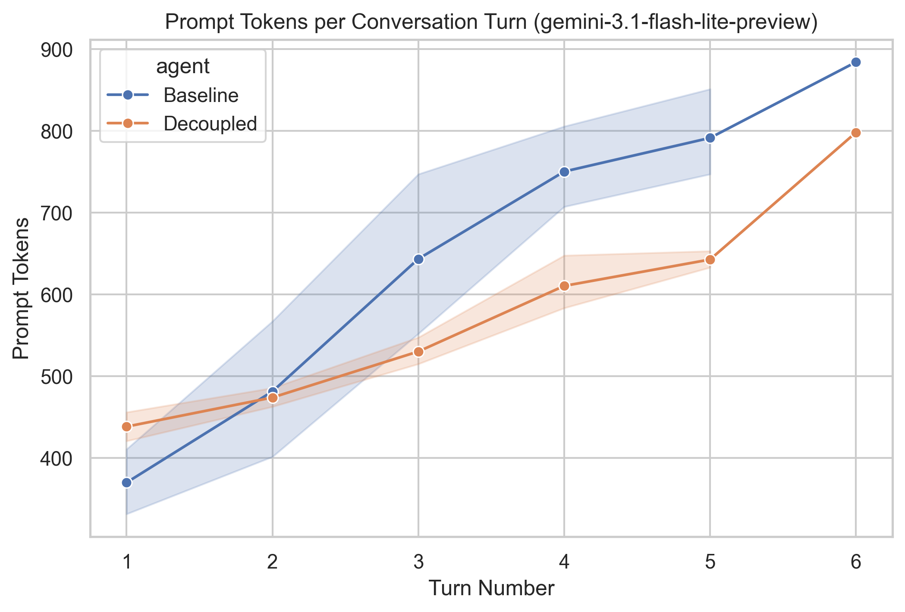
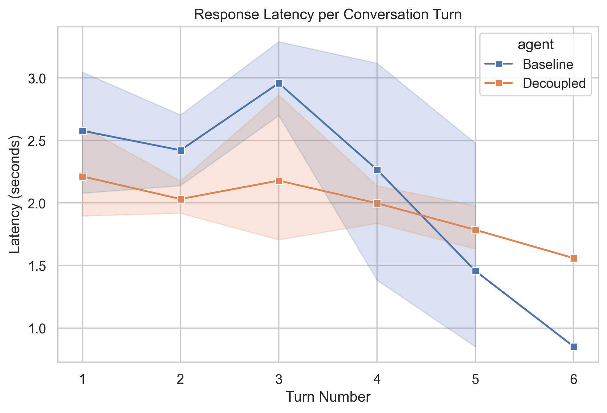

**Title:** Decoupled Working Memory for Agentic LLMs: Mitigating Context Bloat in Task-Oriented Dialogue
**Group Members:** Veysel Reşit Çaçan

### **Abstract**
When executing complex tasks, task-oriented conversational agents utilizing the ReAct framework often suffer from "context bloat." Because they inject proprietary API details, tool scratchpads, and backend execution states directly into the standard conversational message history, token counts grow rapidly over multi-turn interactions. 

This project introduces a "Decoupled Working Memory" architecture using LangGraph and the `gemini-3.1-flash-lite-preview` model. By explicitly filtering backend tool calls out of the conversational history and managing state in an isolated JSON dictionary, we significantly reduced the rate of token accumulation over multi-turn conversations. Our evaluation demonstrates that while the decoupled approach requires a slightly higher initial token overhead, it flattens the token growth curve and yields more stable response latencies compared to a baseline agent.

### **1. Problem Definition and Motivation**
In task-oriented dialog (e.g., hotel bookings, customer support), Large Language Models (LLMs) must juggle user-facing conversation with backend technical constraints. For example, a user might ask for an "ocean view room," which the system must map to a proprietary backend ID (e.g., `OV-2002-ABC`) to execute an API call.

Standard agent frameworks natively append all tool interactions—including long JSON schemas and API responses—into the standard `MessageHistory`. Over a 5-to-10 turn conversation where a user changes their mind multiple times, this technical state quickly bloats the context window. 

This bloat increases API costs, risks pushing the LLM past its context limits, and degrades response latency. This project aims to solve this by creating a partitioned memory system where the LLM can silently read/write technical parameters without clogging the user-facing dialogue history.

### **2. Dataset / Data Source**
Because this project evaluates architectural memory limits, our dataset consists of simulated multi-turn conversations paired with a mock backend database. 
*   **Mock PMS (Property Management System):** A Python dictionary mapping natural language terms to proprietary IDs (e.g., `"ocean view": "OV-2002-ABC"`).
*   **Conversation Transcripts:** 5 distinct, multi-turn hotel booking transcripts (ranging from 4 to 6 turns each). These transcripts were specifically designed to simulate hesitant users who change parameters mid-conversation (e.g., altering dates, room types, or guest counts), forcing the agent to continuously update its internal state prior to final execution.

### **3. LLM Methodology**
We implemented our system using **LangGraph** to construct explicit state machines.

**Baseline Agent:**
We constructed a standard ReAct agent that maintains a single `messages` array. The model was provided with two tools: `update_working_memory` and `execute_booking`. In this baseline, all `HumanMessage`, `AIMessage` (including tool execution scratchpads), and `ToolMessage` outputs were appended linearly to the context history.

**Decoupled Agent (Proposed Method):**
We defined a custom LangGraph `TypedDict` containing two distinct keys: `messages` (for user dialogue) and `working_memory` (a separate JSON object). The memory mechanism operates via three steps:
1.  **State Injection:** At the start of every turn, the current `working_memory` JSON is dynamically injected into the System Prompt.
2.  **History Filtering:** Before passing the conversational history to the LLM, a custom LangGraph node strips out all `ToolMessage` objects and `AIMessage` tool-call metadata. 
3.  **Silent Updates:** When the LLM uses the update tool, the LangGraph tool node intercepts the arguments, updates the decoupled `working_memory` dictionary, and returns a clean state without polluting the dialogue array.

### **4. Experiments and Results**
We ran the 5 multi-turn transcripts through both the Baseline and Decoupled agents, recording prompt tokens and response latency at every turn. 

**Token Optimization (Context Bloat Reduction):**
As shown in the *Prompt Tokens per Conversation Turn* graph, the Baseline agent exhibits steep, linear token growth. By Turn 6, the Baseline agent reached 884 prompt tokens. In contrast, the Decoupled agent demonstrates a much shallower growth curve, concluding Turn 6 at 798 tokens. 

Interestingly, the data reveals an initial overhead cost: at Turn 1, the Decoupled agent uses slightly more tokens than the Baseline (e.g., Conversation 0: 419 vs 334 tokens). This is due to the baseline system prompt being static, while the decoupled agent injects the JSON memory schema immediately. 

However, the lines intersect at Turn 2, after which the Decoupled agent's history filtering successfully prevents the aggressive compounding bloat seen in the baseline.

**Latency Improvements:**
The *Response Latency* graph highlights increased stability in the Decoupled architecture. 

The Baseline agent's latency is highly volatile, spiking to 3.63 seconds at Turn 3. The Decoupled agent maintains a much tighter, more consistent latency band, hovering smoothly around 1.8 to 2.3 seconds across the entire conversation. 

By removing dense JSON tool-calls from the conversational history, the Gemini model processes the prompt more efficiently.

### **5. Discussion and Limitations**
The results confirm that strictly decoupling technical state from conversational history effectively mitigates linear context bloat. However, there are limitations:
1.  **System Prompt Overhead:** The decoupled architecture requires the dynamic JSON state to be injected into the system prompt at every turn. If the technical state is massive (e.g., thousands of keys), this method would still result in heavy token usage.
2.  **Model Dependency:** Filtering out tool messages relies on the LLM's ability to seamlessly bridge the gap between its system prompt instructions and the user dialogue. Less capable models than Gemini 3.1 Flash might hallucinate or lose track of conversation flow if they cannot see their past tool-call scratchpads.

### **6. Conclusion**
Standard agent architectures inefficiently store backend API data in the chat history, leading to compounding token costs and volatile latency. 

By utilizing LangGraph to isolate technical tool interactions into a decoupled "working memory" dictionary, we successfully reduced context bloat for multi-turn task-oriented agents. 

This approach provides a scalable framework for building cost-effective chatbots that must interact with complex proprietary backend systems.

### **References**
*   [LangGraph Documentation](https://docs.langchain.com/oss/python/langgraph/overview)

